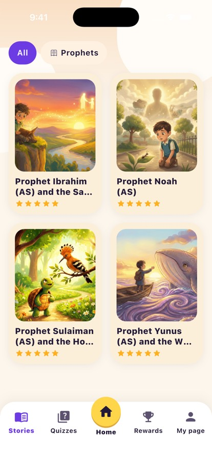
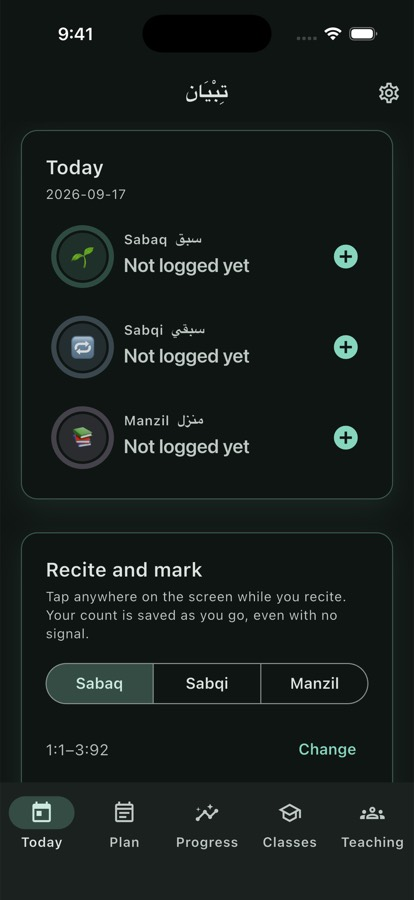
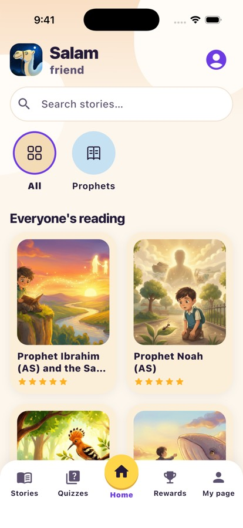
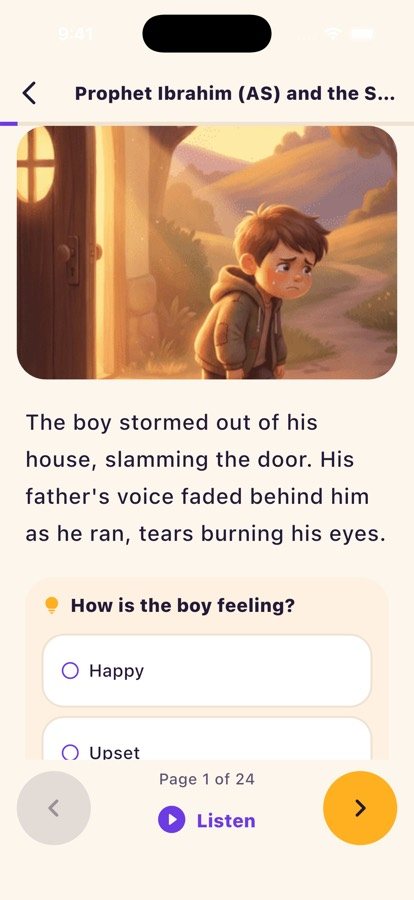
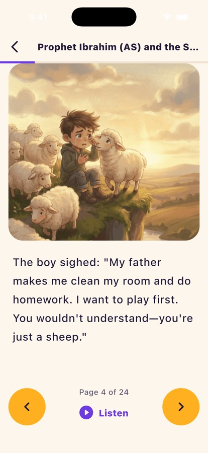
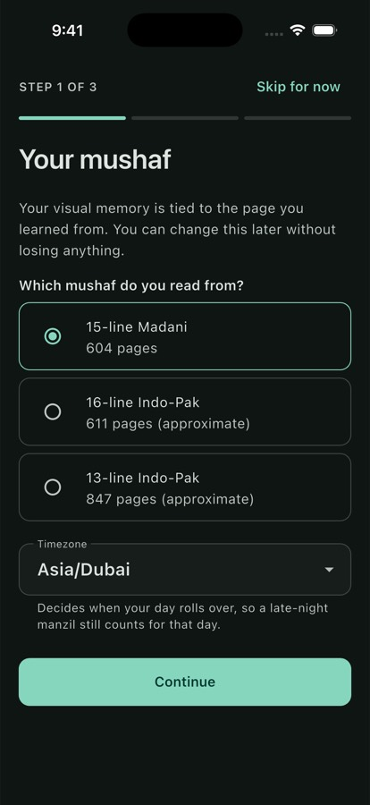
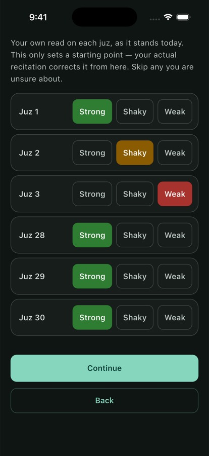
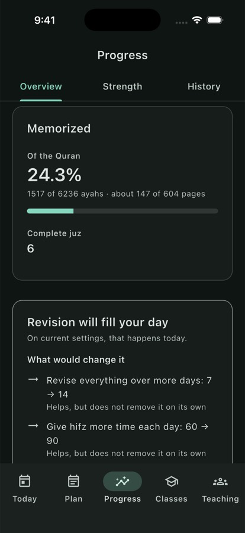

# app_builds

Android test builds of the four Al-Qaswa apps, for testers. Each build is a dated folder; the APK itself is attached to a [GitHub Release](../../releases), not stored in git.

| | App | What it is | Latest build |
| --- | --- | --- | --- |
|  | **[Salah](salah/)** | Keep your salah: the five prayers marked honestly, and the qada you still owe. | _none yet_ |
|  | **[Qaswa](qaswa/)** | Illustrated prophet stories for children, in English, Urdu, Arabic and French. | _none yet_ |
|  | **[Tibyan](tibyan/)** | Qur'an memorisation tracked the way it is taught: sabaq, sabqi and manzil. | _none yet_ |
|  | **[Adhkar](adhkar/)** | A pocket book of the Muslim: morning and evening adhkar and 327 supplications, each with its citation. | [4 Oct 2026 · 1.3.0 (14)](adhkar/2026-10-04-sun/) |

## Screenshots

**Salah** <br>
   

**Qaswa** <br>
   

**Tibyan** <br>
   

**Adhkar** <br>
   

## Installing a build

1. Open the build's folder and follow its **Download** link to the Release page.
2. Download the `.apk` on your Android phone.
3. Open it and allow "Install unknown apps" for your browser or Files app when asked.

These are **testing builds**, signed with a debug key. They install fine, but they cannot update over a future store build — uninstall first when moving to one. Please don't redistribute them.

## Layout

```
<app>/
  screenshots/
  <yyyy-mm-dd-day>/README.md     notes + download link for that build
```

Builds are named `<app>-<version>-build<n>-debugsigned.apk` and tagged `<app>-<yyyy-mm-dd>` (e.g. `adhkar-2026-10-04`).
